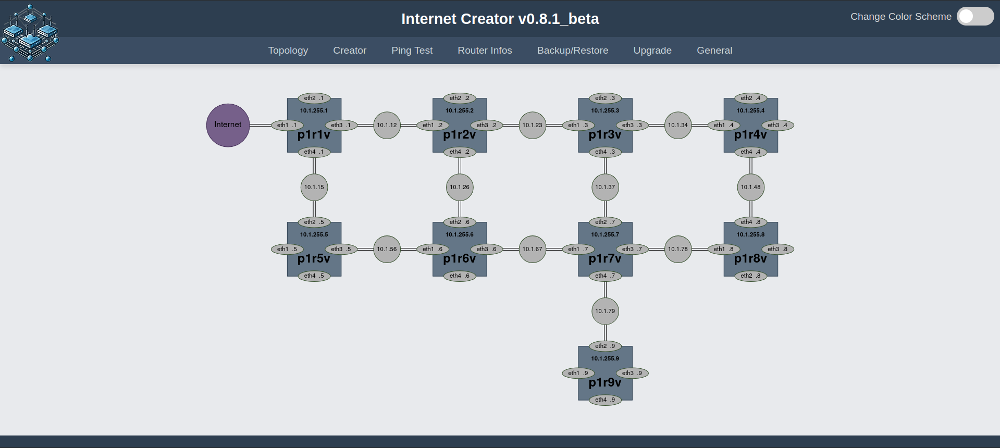
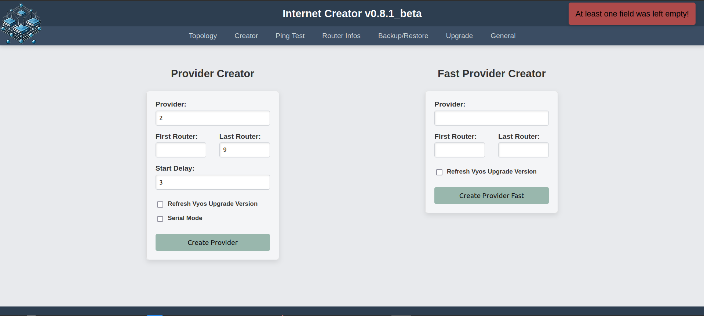
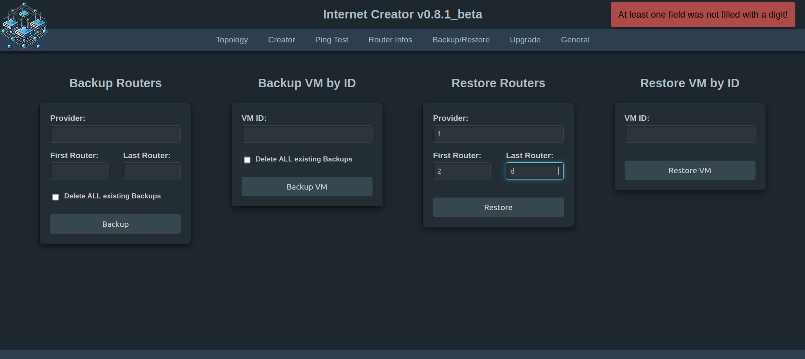
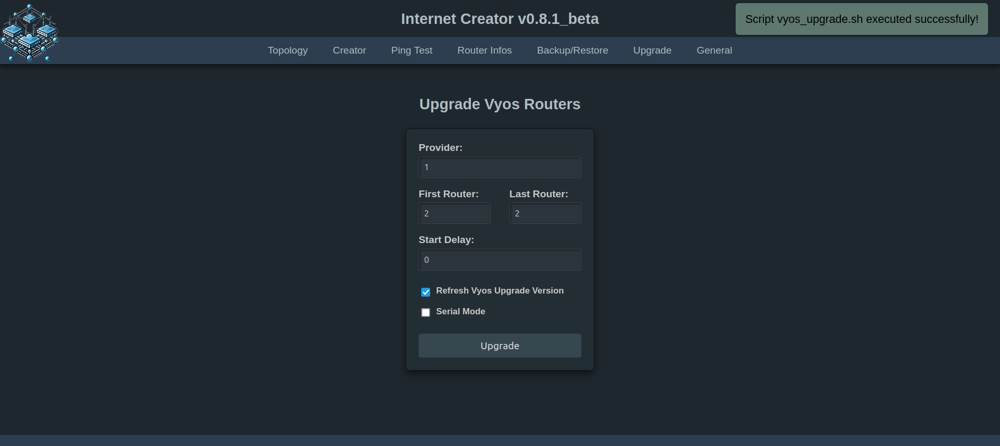
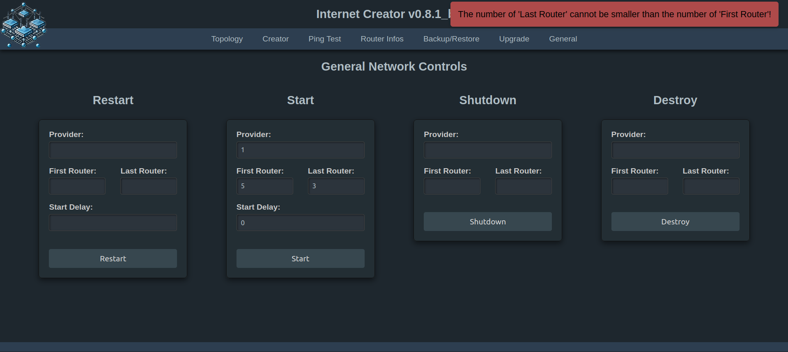

## Verwendungszwecke:

Es geht hier darum, drei Netzwerke (ISP's) bestehend aus jeweils 9 Vyos-Routern automatisiert unter PVE aufzusetzen und mit Ansible zu konfigurieren. Der Internet Creator steuert eine abgewandelte Version von [aibix0001 (Gerd's) provider.sh](https://github.com/aibix0001/aasil), die darauf ausgelegt ist, sich bzgl. der Arbeitsgeschwindigkeit an die Gegebenheiten verschieden starker CPU's anzupassen: So gibt es einen Fast Modus für Rechner mit besonders starken CPU's, einen Normalmodus für schwächere CPU's und einen seriellen Modus für besonders schwache CPU's. Um den passenden Modus für die jeweils verwendete CPU zu finden, siehe den Abschnitt 'Erfahrungswerte' im 'Beschreibung und Gebrauchshinweise zum INC v0.8.1_beta.pdf'. Das [Aibix-Projekt](https://www.twitch.tv/aibix0001) wendet sich u.a. an Auszubildende und Studenten im IT-Bereich, sowie weitere Interessierte, die nicht unbedingt immer drei Kraftpakete zur Verfügung haben. Der Internet Creator ist deshalb insbesondere auch zur Verwendung mit schwächeren Rechnern entwickelt worden.

## Neueinsteiger

Für alle, die mit den [Streams](https://github.com/aibix0001/streams) von Aibix nicht von Anfang an vertraut sind, gibt es anstatt des Quickstarts das Setup.pdf, in dem der Aufbau des speziellen PVE-Setup's im Einzelnen beschrieben wird, innerhalb dessen der 'streams'-Ordner mit dem Internet Creator läuft.

## Besondere Voraussetzungen

sudo apt install jq

python3 -m venv .venv

source .venv/bin/activate

pip3 install -U setuptools wheel scp ansible paramiko flask flask-socketio gunicorn eventlet

## Quickstart

Nach dem Clonen dieses Repos den Ordner streams aus dem Ordner internet_creator_v0.8.1_beta herausnehmen und in den Pfad /home/user/ des PVE-Hosts ablegen und dann von da aus arbeiten.

Der Internet Creator wird folgendermaßen aufgerufen:

(1) ein vyos.qcow2 Image erstellen (siehe Setup.pdf) und unter /home/user/streams/create-vms/create-vms-vyos/ ablegen,

(2) für alle, deren User nicht user heißt: Am besten das Skript useradd.sh (als root) laufen lassen. Das spart eine Menge Arbeit (vgl. Beschreibung und Gebrauchshinweise zum INC v0.8.pdf Anmerkung (4)). Ansonsten im create-vm-vyos_XYfs.sh Zeile 43 anpassen. Außerdem sind die SSH-Credentials in der Datei user-data beim Erstellen der seed.iso anzupassen, sowie die ansible.cfg 

(3) eine seed.iso erstellen (siehe Setup.pdf) und unter /var/lib/vz/template/iso/ bzw. /var/lib/pve/local-btrfs/template/iso/ ablegen.

Und dann eingeben:

source .venv/bin/activate

cd streams

./inc.sh

Oder ./go.sh unter /home/user/ ausführen - noch einfacher mit alias go='./go.sh' in der .bashrc

Bei der allerersten Verwendung auf jeden Fall die Option Refresh Vyos Upgrade Version anhaken, ansonsten findet kein Upgrade statt, sondern es wird diejenige Version verwendet, die dem vyos.qcow2 Image zugrunde liegt. Außerdem wird der Hostname dann nicht gesetzt (sondern bleibt 'vyos').

Nötigenfalls sudo-Password des Users im Terminal eingeben.

Nicht zusammen mit Dark Reader verwenden!

## Neue Features des INC v0.8.1_beta

Der Internet Creator v0.8 ermöglicht nun auch Backup und Restore von Routern und sonstigen VMs, wie insbesondere des/der DHCP-Server(s) und der pfSense(n), was beim Neuaufsetzen ganzer PVEs so genutzt werden kann, dass der DHCP-Server und die pfSense mittels Restore eines vorhandenen Backups erstellt werden. Das geht zwar auch über die PVE-Oberfläche, im Internet Creator sind dafür aber erheblich weniger Eingaben nötig.

Upgrades einzelner oder mehrerer bestehender Vyos-Router können komfortabel ausgeführt werden.

Die Eingabefelder für Node und Limit gibt es nicht mehr. Das Eingabefeld für Routers ist in First Router und Last Router aufgeteilt worden, sodass nicht, wie bisher, grundsätzlich immer mit Router 1 angefangen wird. Das ist insbesondere für Anwender nützlich, die ihren PVE-Node auf einem Rechner mit 16 GB RAM betreiben. In diesem Fall kann ein aus 9 Routern bestehender Provider in zwei Serien von z.B. einmal 5 und einmal 4 Routern erstellt werden. Damit ist auch der Single Router Creator überflüssig geworden: Wer einen einzelnen Router erstellen, backupen, restoren oder upgraden will, gibt für First Router und Last Router die gleiche Zahl ein.

Bei fehlerhaften Formulareingaben oder erfolgreichen Skriptausführungen gibt es Systemrückmeldungen im Frontend (die nach 7 Sekunden von selber wieder verschwinden) und die Systemmeldungen im Backend sind überarbeitet worden.

Außerdem sind das Layout und fast alle Bash-Skripte gründlich überarbeitet worden.

## Spezielle Probleme der Version v0.8.1_beta

Statt auf einem Development-Server läuft die Web App auf einem professionellen Gunicorn Server. Obwohl das Frontend weitestgehend unauffällig läuft, gibt es im Backend regelmäßig Fehlermeldungen, die bislang nicht abgestellt werden konnten. Diese Fehlermeldungen treten aber nur im Zusammenhang mit der Verwendung des flask-socketio beim Ping-Test und der Anzeige von Routerinformationen auf und sind offenbar darauf zurückzuführen, dass sich der Gunicorn-Server bzw. das Eventlet-Modul mit dem socketio nicht ganz verträgt. Zu Einzelheiten siehe 'Spezielle Probleme der Version 0.8.1_beta.pdf'. 

Achtung: Sobald man 'pip install gunicorn eventlet' in der .venv ausgeführt hat, wird der Ping Test und die Ausgabe der Router Infos unter Version 0.8 in dieser .venv nicht mehr funktionieren. Man braucht dann vorher:

pip uninstall gunicorn eventlet

## Troubleshooting

Insbesondere bei schwächeren/langsameren Rechnern kann es in seltenen Fällen Timeoutprobleme geben. Dazu bitte die Datei Timeoutprobleme.pdf lesen. Vermutlich sind Timeoutprobleme in den allermeisten Fällen auf die Verwendung von Swap zurückzuführen!

Sollte mal der (seltene) Fall eintreten, dass obwohl alles korrekt aussieht - die Configs der Router sind ok, es gibt ein DHCP-Lease von der pfSense und die VLAN-Tags des LAN Netzes stimmen auch (also 1011, 2011 bzw. 3011) - es aber trotzdem nicht möglich ist, raus zu pingen, dann alle Router restarten. Wenn es dann immer noch nicht geht, mit anderem (meistens höherem) Delay-Wert oder ggf. im Fast Modus nochmal neu erzeugen.
